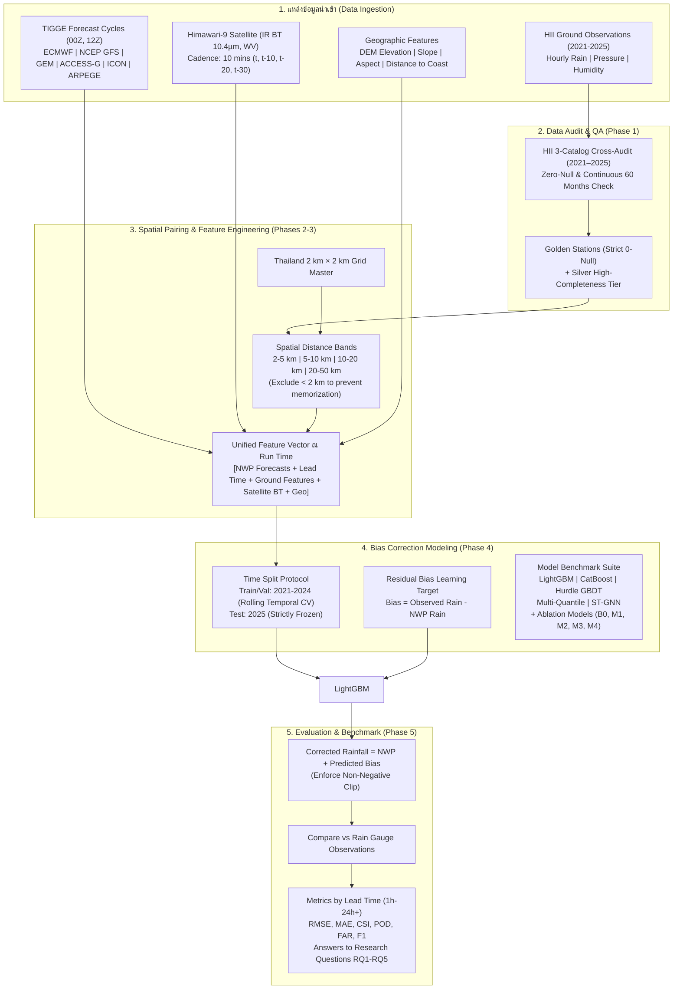

# 🗺️ Master Plan & Phase Roadmap: Weather Forecast Bias Correction

> **โครงการ**: Thailand 2 km × 2 km Weather Model Precipitation Bias Correction  
> **เอกสารอ้างอิงหลัก**: [`weather-forcast-enhance/plan.md`](file:///e:/water-analysis-project/weather-forcast-enhance/plan.md)  
> **เป้าหมายหลัก**: พัฒนาระบบ ML Bias Correction สำหรับพยากรณ์ปริมาณน้ำฝนเชิงพื้นที่ (Spatial Precipitation) ความละเอียด 2 km × 2 km ทั่วประเทศไทย โดยผสานข้อมูลพยากรณ์จาก Numerical Weather Prediction (TIGGE Archive: ECMWF, NCEP GFS, GEM, ACCESS-G, ICON, ARPEGE), ภาพถ่ายดาวเทียมอุตุนิยมวิทยา Himawari-9 และสถานีตรวจวัดภาคพื้นดิน (Ground Observations)

---

## 1. ภาพรวมสถาปัตยกรรมระบบ (End-to-End System Architecture)



---

## 2. โครงสร้างการแบ่ง Phase ทั้งหมด (Phased Implementation Roadmap)

เอกสารแผนงานแต่ละ Phase ถูกจัดเก็บในไดเรกทอรีนี้อย่างเป็นสัดส่วน ดังนี้:

| Phase | เอกสารแผนงาน | ขอบเขตและหน้าที่หลัก | ผลลัพธ์ที่ได้ (Deliverables) |
|---|---|---|---|
| **Phase 1** | [`phase_01_ground_data_audit_and_acquisition.md`](file:///e:/water-analysis-project/weather-forcast-enhance/ai-docs/plan/phase_01_ground_data_audit_and_acquisition.md) | **Ground Data Ingestion & Quality Audit (2021–2025)**<br>- เชื่อมโยง HII Catalog (Hourly Rain, Pressure, Humidity)<br>- ตรวจสอบสถานีที่มีข้อมูลครบทุกเดือน (60 เดือน) แบบ **Zero-Null**<br>- สรุปบัญชีสถานีระดับ Golden Tier และ Silver Tier | - รายงานสถานีสมบูรณ์ 100% (Zero-Null Report)<br>- Script ตรวจสอบและดึงข้อมูลอัตโนมัติ<br>- Ground Observation Parquet DB |
| **Phase 2** | [`phase_02_remote_sensing_and_nwp_integration.md`](file:///e:/water-analysis-project/weather-forcast-enhance/ai-docs/plan/phase_02_remote_sensing_and_nwp_integration.md) | **Remote Sensing (Himawari-9) & NWP Forecast Cycles**<br>- ดึงค่า Brightness Temperature (Band 13, Band 8) ย้อนหลัง<br>- ผูกข้อมูล NWP ตาม Forecast Run Cycle ($00Z, 06Z, 12Z, 18Z$)<br>- คำนวณ `lead_time = valid_time - run_time` พร้อมจัดเก็บ | - Dataset พยากรณ์ตามรอบ Run Time<br>- Himawari Cloud Evolution Features<br>- Anti-leakage verification protocol |
| **Phase 3** | [`phase_03_spatial_grid_and_feature_engineering.md`](file:///e:/water-analysis-project/weather-forcast-enhance/ai-docs/plan/phase_03_spatial_grid_and_feature_engineering.md) | **2 km Grid Generation & Spatial Feature Engineering**<br>- สร้าง Master Grid 2 km × 2 km ครอบคลุมประเทศไทย<br>- คำนวณ Spatial Distance Bands (2–5, 5–10, 10–20, 20–50 km)<br>- คำนวณ Bearing ($\sin/\cos$), Spatial Gradients ($\nabla P, \nabla RH$) | - 2 km Grid Geometry Index (R-tree / KDTree)<br>- Spatial Aggregation Pipeline<br>- Unified Training Dataset |
| **Phase 4** | [`phase_04_bias_correction_modeling_and_training.md`](file:///e:/water-analysis-project/weather-forcast-enhance/ai-docs/plan/phase_04_bias_correction_modeling_and_training.md) | **ML Bias Correction Architecture & Temporal Training**<br>- พัฒนาชุดโมเดล 4 ตระกูล (LightGBM, CatBoost, Hurdle GBDT, Multi-Quantile, ST-GNN)<br>- ทำการทดลอง Ablation Study ($B_0, M_1, M_2, M_3, M_4$)<br>- Temporal Split Protocol: 2021–2024 (Train/Val), 2025 (Test) | - Pre-trained Bias Correction Models<br>- Model Checkpoints & Feature Importances<br>- Ablation Experiment Results |
| **Phase 5** | [`phase_05_evaluation_benchmarking_and_reporting.md`](file:///e:/water-analysis-project/weather-forcast-enhance/ai-docs/plan/phase_05_evaluation_benchmarking_and_reporting.md) | **Hydrological Evaluation, Lead-time Horizon & RQ Validation**<br>- ประเมินความแม่นยำต่อเนื่อง (RMSE, MAE, Bias, Correlation)<br>- ประเมินตามเกณฑ์ฝน (CSI, POD, FAR, F1 @ $\ge 0.1, 2, 10, 20$ mm/h)<br>- วิเคราะห์พฤติกรรมตาม Lead Time (1h–24h) และตอบคำถามวิจัย RQ1–RQ5 | - Comprehensive Evaluation Report<br>- Lead Time Error Curves<br>- Contingency Analysis & Visual Maps |

---

## 3. หลักการสำคัญที่ต้องควบคุมอย่างเคร่งครัด (Key System Invariants)

1. **กฎพื้นที่ทำงานแบบปิดบริบูรณ์ (Strictly Self-Contained Workspace Invariant)**:
   - โค้ดทั้งหมด (`src/`), ไฟล์คอนฟิก (`configs/`), ข้อมูลดิบและข้อมูลที่คลีนแล้ว (`data/`), แบบจำลอง (`models/`), และผลลัพธ์ (`outputs/`) **ต้องจัดเก็บและถูกเรียกใช้งานอยู่ภายใต้ไดเรกทอรี `weather-forcast-enhance/` ทั้งหมด 100%**
   - **ห้ามเรียกใช้งาน (import / path reference) ไฟล์หรือโฟลเดอร์ใดๆ นอก `weather-forcast-enhance/` โดยเด็ดขาด** (เช่น ไม่พึ่งพาโฟลเดอร์ `weather-forcast-benchmark`, `flood-analysis-*` หรือโฟลเดอร์รูทภายนอก) ระบบต้องสามารถรันและทำงานได้สมบูรณ์ในตัวเอง (Self-Contained & Standalone)
2. **Forecast Cycle เป็นแกนหลัก (Run-time vs Valid-time)**:
   - ห้ามใช้ valid-time เป็นแกนเวลาอิสระ ข้อมูลทุกแถวใน dataset ต้องผูกกับ `run_time`, `valid_time`, และ `lead_time` เสมอ
3. **ห้ามเกิด Data Leakage เชิงเวลา (Zero Look-ahead Bias)**:
   - ณ `run_time` ใดๆ โมเดลต้องเข้าถึงได้เฉพาะ Ground Observation และ Himawari-9 ที่บันทึกก่อนหน้าหรือตรงกับ `run_time` เท่านั้น ห้ามเห็น observation ในอนาคตระหว่างทางของ lead time
4. **ระยะห่างสถานีขั้นต่ำสำหรับ Spatial Features**:
   - ระยะ < 2 km จากจุดศูนย์กลาง grid จะ **ไม่ถูกนำมาใช้เป็น nearby station** เพื่อป้องกันโมเดลท่องจำ observation ที่จุดเดียวกัน
5. **Frozen Final Test 2025**:
   - ข้อมูลปี 2025 ทั้งปีถูกกันไว้เป็น Unseen Test Set อย่างเด็ดขาด ห้ามใช้คัดเลือก feature หรือปรับ hyperparameter ใดๆ ทั้งสิ้น
6. **No Code Rule ในขั้นตอนนี้**:
   - ยึดมั่นตามคำสั่งของผู้ใช้: ทำการวางแผนทุกมิติให้สมบูรณ์ ละเอียด และรอบคอบก่อนการเริ่มลงมือเขียนโค้ด
7. **กฎเหล็กการกันข้อมูลสถานี DWR (`weather-forcast-enhance/dataset/dwr_rain/`)**:
   - ข้อมูลฝนของกรมทรัพยากรน้ำ (DWR) ทั้งหมดถูกสงวนไว้เป็น **100% Blind Out-of-Network Spatial Hold-Out** สำหรับประเมินความแม่นยำบนสถานีที่ไม่รู้จักใน Phase 5 เท่านั้น **ห้ามนำไปใช้ในการฝึกสอน (Train) หรือสกัด Spatial Feature ในขั้นตอนใดๆ ทั้งสิ้น 100%!** (ไม่ต้องแบ่ง 15-20% ของ HII เพราะ DWR เป็นสถานีที่ไม่รู้จักแน่นอน)
8. **นโยบายการพัฒนาบน PC vs การรันจริงบน Server (Development vs Server Execution Protocol)** 🚨:
   - **ห้ามดาวน์โหลด Full Data ตอนพัฒนาโค้ดบนเครื่อง PC**: ในช่วง Dev สคริปต์ดาวน์โหลดทุกตัว (`hii_audit.py`, `hii_downloader.py`, `tigge_downloader.py`, `himawari_extractor.py`) จะทำงานในโหมด **`--sample` / `--smoke-test`** เท่านั้น (โหลดเฉพาะ 1–5 สถานี หรือช่วงเวลาสั้นๆ ไม่กี่วัน) เพื่อทดสอบฟังก์ชัน การแปลงไฟล์ และ Schema ความถูกต้อง การดาวน์โหลดเต็มทั้ง 60 เดือน (2021–2025) จะทำ **"ตอนเริ่มรันงานจริงบน Server"** (ผ่านแฟล็ก `--full`)
   - **กฎเหล็กห้ามรันการฝึกสอนโมเดล (Train) บนเครื่อง PC โดยเด็ดขาด**: เนื่องจากสเปกเครื่อง PC ของผู้ใช้ไม่เอื้ออำนวยต่อภาระงาน ML/DL ขนาดใหญ่ **ห้ามสั่งรันโมเดล Training ขนาดจริงบน PC เด็ดขาด** บน PC อนุญาตเฉพาะการทดสอบ Pipeline เบื้องต้น (Smoke Test ด้วย mock/sample 50–100 แถว รัน 1 epoch ผ่านแฟล็ก `--smoke-test`) เพื่อยืนยันว่าโค้ดคอมไพล์ผ่านและบันทึกไฟล์ได้ถูกต้อง ส่วนการฝึกสอนจริง 18 Pipelines ทั้งหมด ($6 \text{ Models} \times 3 \text{ Variants}$) บนชุดข้อมูล 2021–2024 ผู้ใช้จะนำโค้ดไปรันบน Server เอง

---

## 4. โครงสร้างไดเรกทอรีโครงการแบบเบ็ดเสร็จ (Project Self-Contained Layout)

ทุกไฟล์และโมดูลของโครงการถูกกำหนดให้อยู่ภายในโครงสร้างนี้เท่านั้น:

```text
weather-forcast-enhance/
├── ai-docs/
│   └── plan/                                    # เอกสารแผนงานทั้ง 5 Phases และ Master Roadmap
│       ├── README.md
│       ├── phase_01_ground_data_audit_and_acquisition.md
│       ├── phase_02_remote_sensing_and_nwp_integration.md
│       ├── phase_03_spatial_grid_and_feature_engineering.md
│       ├── phase_04_bias_correction_modeling_and_training.md
│       ├── phase_05_evaluation_benchmarking_and_reporting.md
│       └── feature_dictionary.md                    # พจนานุกรมและข้อกำหนดฟีเจอร์สำหรับฝึกโมเดลทั้งหมด
├── configs/                                     # ไฟล์ตั้งค่าระบบแยกตามโมเดลและ Variant
│   ├── data_audit_config.yaml
│   ├── nwp_fetch_config.yaml
│   └── models/                                  # Config แยกโมเดลและแยกรอบการทดลอง M1, M2, M3
│       ├── lightgbm/ (lgbm_m1.yaml, lgbm_m2.yaml, lgbm_m3.yaml)
│       ├── catboost/ (cat_m1.yaml, cat_m2.yaml, cat_m3.yaml)
│       ├── hurdle/   (hurdle_m1.yaml, hurdle_m2.yaml, hurdle_m3.yaml)
│       ├── quantile/ (quant_m1.yaml, quant_m2.yaml, quant_m3.yaml)
│       ├── stgnn/    (stgnn_m1.yaml, stgnn_m2.yaml, stgnn_m3.yaml)
│       └── unet/     (unet_m1.yaml, unet_m2.yaml, unet_m3.yaml)
├── src/                                         # ซอร์สโค้ด Python ทั้งหมดของโครงการ
│   ├── data/                                    # โมดูลดาวน์โหลดและประมวลผลข้อมูล
│   │   ├── hii_audit.py                         # สแกนสถานี Zero-Null 2021-2025
│   │   ├── hii_downloader.py                    # ดาวน์โหลดและทำ Parquet
│   │   ├── tigge_downloader.py                  # ดึง TIGGE Archive (6 โมเดล) ผ่าน cdsapi
│   │   ├── tigge_extractor.py                   # แปลง GRIB2 เป็น Grid 2km ด้วย xarray/cfgrib
│   │   └── himawari_extractor.py                # ดึงค่า IR BT Band 13 & WV Band 8
│   ├── features/                                # โมดูล Spatial Grid & Feature Engineering
│   │   ├── grid_generator.py                    # สร้าง 2 km Master Grid
│   │   ├── spatial_pairing.py                   # คำนวณ Distance Bands & Bearing
│   │   └── gradient_calculator.py               # คำนวณ Pressure / Humidity Gradients
│   ├── models/                                  # โมดูลสร้างและเทรนแบบจำลอง
│   │   ├── bias_residual_dataset.py             # จัดทำ Feature Matrix สำหรับ ML
│   │   └── runners/                             # Isolated Pipeline Runners (รองรับแฟล็ก --dir)
│   │       ├── run_lightgbm.py                  # Runner รัน LightGBM (M1..M3) [--dir <path>]
│   │       ├── run_catboost.py                  # Runner รัน CatBoost (M1..M3) [--dir <path>]
│   │       ├── run_hurdle.py                    # Runner รัน Hurdle Two-Stage [--dir <path>]
│   │       ├── run_quantile.py                  # Runner รัน Multi-Quantile [--dir <path>]
│   │       ├── run_stgnn.py                     # Runner รัน ST-GNN [--dir <path>]
│   │       └── run_unet.py                      # Runner รัน 2D U-Net [--dir <path>]
│   └── evaluation/                              # โมดูลประเมินผลและสร้างกราฟ (รองรับแฟล็ก --dir)
│       ├── run_evaluation.py                    # คำนวณ Metrics ทั้งหมด [--dir <path>]
│       └── generate_benchmark_charts.py         # สร้างกราฟวิเคราะห์ทุกมิติ [--dir <path>]
├── dataset/                                     # ชุดข้อมูลอิสระสำหรับ Blind Test
│   └── dwr_rain/                                # ข้อมูลฝนสถานี DWR (100% Blind Spatial Hold-Out - ห้ามใช้เทรนเด็ดขาด)
│       ├── {basin}_dwr_hourly_rain.csv          # ข้อมูลฝนรายชั่วโมงระดับลุ่มน้ำ (ยม, น่าน, ชี, มูล ฯลฯ)
│       └── station/                             # พิกัด Metadata สถานี DWR
├── data/                                        # จัดเก็บข้อมูลทั้งหมด (ไม่มีการดึงจากภายนอก)
│   ├── raw/                                     # ข้อมูลดิบที่ดาวน์โหลดจากแหล่งต้นทาง
│   │   ├── hii_hourly_rain/
│   │   ├── hii_pressure/
│   │   ├── hii_humidity/
│   │   ├── nwp_runs/                            # TIGGE GRIB2 & Parquet (ecmf, kwbc, cwao, ammc, edzw, lfpw)
│   │   └── himawari9/
│   ├── audit/                                   # ผลลัพธ์การสแกนความสมบูรณ์และ Zero-Null
│   │   ├── golden_stations_zero_null_2021_2025.csv
│   │   └── audit_summary_report.md
│   ├── clean_parquet/                           # ข้อมูลที่ผ่านการคลีนและจัดฟอร์แมตแล้ว
│   ├── geo/                                     # Master Grid 2km และข้อมูล SRTM DEM
│   └── features/                                # Unified Feature Tables พร้อมฝึกโมเดล
└── [output_dir]/                                # ปลายทางเก็บผลลัพธ์ กำหนดผ่านแฟล็ก --dir (Default: outputs/)
    ├── models/                                  # 1. เช็คพอยต์และไฟล์โมเดลแต่ละแบบแยกรายสถาปัตยกรรม
    │   ├── lightgbm/ (m1/, m2/, m3/)
    │   ├── catboost/ (m1/, m2/, m3/)
    │   ├── hurdle/   (m1/, m2/, m3/)
    │   ├── quantile/ (m1/, m2/, m3/)
    │   ├── stgnn/    (m1/, m2/, m3/)
    │   └── unet/     (m1/, m2/, m3/)
    ├── figures/                                 # 2. ภาพกราฟ (.png, .svg) วิเคราะห์ผลทุกมิติ
    │   ├── 01_lead_time_rmse_mae_curves.png
    │   ├── 02_lead_time_csi_curves.png
    │   ├── 03_model_vs_ablation_heatmap.png
    │   ├── 04a_heavy_rain_warning_accuracy_pod.png # Hit Rate เตือนฝนหนัก
    │   ├── 04b_heavy_rain_false_alarm_rate_far.png # False Alarms เตือนหลอก
    │   ├── 04c_heavy_rain_critical_miss_analysis.png # Critical Misses ตกหนักไม่เตือน
    │   ├── 04d_performance_diagram_roebber.png
    │   ├── 05_dwr_blind_scatter_qq_plot.png
    │   ├── 06_basin_performance_barchart.png
    │   └── 10_national_2km_bias_map.png
    ├── predictions/                             # 3. CSV Results ผลพยากรณ์สำหรับ Benchmark อื่นๆ
    │   ├── unified_benchmark_predictions_2025.csv
    │   ├── dwr_blind_predictions_2025.csv
    │   └── <model>_<ablation>_pred.csv (และ .parquet)
    └── reports/                                 # 4. สรุปตารางตัวเลขและรายงานผล
        ├── final_benchmark_report_2025.md
        ├── lead_time_performance_breakdown.csv
        ├── rain_intensity_contingency_table.csv
        ├── model_ablation_matrix_18runs.csv
        └── heavy_rain_warning_stats.csv
```
