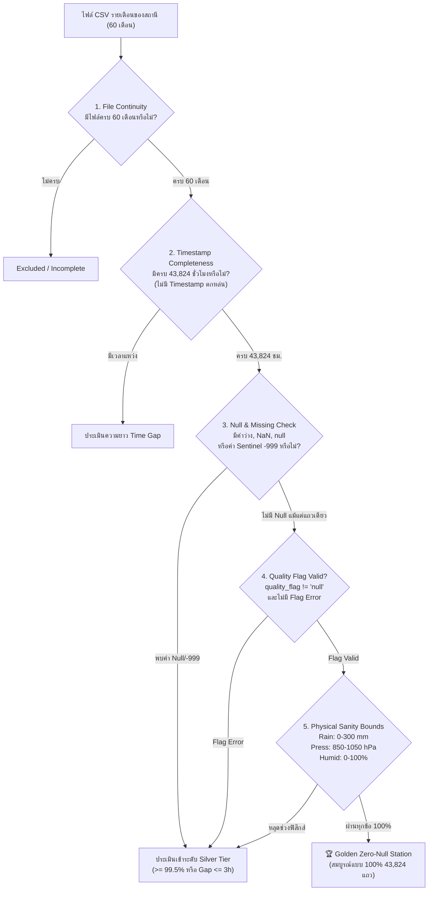

# 📊 Phase 1: Ground Data Acquisition & Zero-Null Completeness Audit (2021–2025)

> **สถานะ**: ร่างแผนงาน (Planning Phase - Strict No Code)  
> **เป้าหมายหลัก**: ดึงข้อมูลและตรวจสอบความสมบูรณ์ของสถานีตรวจวัดภาคพื้นดินจาก HII Open Data Catalog ครอบคลุม 3 ตัวแปรสภาพอากาศ (ฝน, ความกดอากาศ, ความชื้นสัมพัทธ์) โดยทำการสแกนและคัดกรองสถานีที่มีข้อมูล **ครบทุกเดือน (60 เดือน) และไม่มีแถวที่เป็น null / ค่าผิดพลาดแม้แต่แถวเดียว (Zero-Null)** ตลอดช่วงปี 2021 ถึง 2025  
> **ข้อกำหนดพื้นที่ทำงาน**: ทุกไฟล์สคริปต์ (`src/data/`), ไฟล์ข้อมูล (`data/raw/`, `data/audit/`, `data/clean_parquet/`) ต้องอยู่ภายใต้ `weather-forcast-enhance/` ทั้งหมด ไม่มีการอ้างอิงหรือเรียกไฟล์จากภายนอก

---

## 1. แหล่งข้อมูลเป้าหมาย (Data Sources & Catalogs)

ข้อมูลดึงจาก Open Data Catalog ของสถาบันสารสนเทศทรัพยากรน้ำ (องค์การมหาชน) - HII:

| ตัวแปร (Variable) | URL ของ Data Catalog | ชนิดข้อมูลและหน่วยวัด | Schema ในอดีต (2021–2024) | Schema ปัจจุบัน (2025) |
|---|---|---|---|---|
| **Hourly Rain** (ปริมาณฝนรายชั่วโมง) | `https://tiservice.hii.or.th/opendata/data_catalog/hourly_rain/` | ปริมาณฝนสะสมรายชั่วโมง (`mm/h`) | `date,time,rain` | `station_code,measure_datetime,rainfall_1h,quality_flag` |
| **Air Pressure** (ความกดอากาศ) | `https://tiservice.hii.or.th/opendata/data_catalog/pressure/` | ความกดอากาศที่สถานี (`hPa`) | `date,time,press` | `station_code,measure_datetime,pressure,quality_flag` |
| **Relative Humidity** (ความชื้นสัมพัทธ์) | `https://tiservice.hii.or.th/opendata/data_catalog/humidity/` | ความชื้นสัมพัทธ์ (`%`) | `date,time,humid` | `station_code,measure_datetime,humidity,quality_flag` |

---

## 2. ขอบเขตช่วงเวลาและการคำนวณจำนวนชั่วโมงเป้าหมาย (Temporal Scope)

ช่วงเวลาที่ต้องการตรวจสอบ: **1 มกราคม 2021 (00:00:00) ถึง 31 ธันวาคม 2025 (23:00:00)** รวมทั้งสิ้น **5 ปีเต็ม (60 เดือน)**

```text
2021: 365 วัน × 24 ชั่วโมง = 8,760 ชั่วโมง
2022: 365 วัน × 24 ชั่วโมง = 8,760 ชั่วโมง
2023: 365 วัน × 24 ชั่วโมง = 8,760 ชั่วโมง
2024: 366 วัน × 24 ชั่วโมง = 8,784 ชั่วโมง (ปีอธิกสุรทิน / Leap Year)
2025: 365 วัน × 24 ชั่วโมง = 8,760 ชั่วโมง
----------------------------------------------------------------------
รวมทั้งสิ้นต่อ 1 สถานีที่สมบูรณ์ 100%: 43,824 แถว (Hourly Observations)
```

---

## 3. เกณฑ์นิยามความสมบูรณ์และเงื่อนไข Zero-Null (Audit Definitions & Rules)

การจะถือว่าสถานีใดมีข้อมูล **"ครบทุกเดือน และไม่เป็น null สักแถว"** ต้องผ่านการตรวจสอบตามเกณฑ์ 5 ระดับอย่างเคร่งครัด:



### 3.1 นิยามค่า Null / ค่าสูญหาย / ค่าผิดพลาด (Missing & Invalid Definitions)
ในชุดข้อมูลของ HII แต่ละยุคมีรูปแบบการแสดงค่าสูญหายที่แตกต่างกัน จึงต้องตรวจจับทุกรูปแบบต่อไปนี้:
1. **Explicit Nulls**: ค่าว่าง (`""`), ช่องว่าง (`" "`), ข้อความคำว่า `"null"`, `"NULL"`, `"None"`, `"NaN"`, `"nan"`
2. **Sentinel Error Codes**:
   - `-999`, `-999.0` (พบบ่อยที่สุดใน HII เมื่อเซนเซอร์ขัดข้องหรือสายหลุด)
   - `-9999`, `-9999.0`
3. **Missing Timestamps (ชั่วโมงแหว่ง)**:
   - บรรทัดเวลาหายไปจากไฟล์ (เช่น กระโดดจาก `13:00` ไป `15:00` โดยไม่มีแถว `14:00`)
4. **Invalid Quality Flags**:
   - ในไฟล์ปี 2025 คอลัมน์ `quality_flag` มีค่าเป็น `null`, `E` (Error), `M` (Missing), `B` (Bad)
5. **Physical Plausibility Bounds (ขอบเขตที่เป็นไปได้ทางอุตุนิยมวิทยา)**:
   - ปริมาณฝน (`rain`): $0.0 \le R \le 300.0\text{ mm/h}$ (ฝนติดลบคือผิดปกติ, ฝนเกิน 300 mm/h คือเซนเซอร์ล้นหรือกระตุก)
   - ความกดอากาศ (`pressure`): $850.0 \le P \le 1050.0\text{ hPa}$ (ตามระดับความสูงสถานีในไทย)
   - ความชื้นสัมพัทธ์ (`humidity`): $0.0 \le RH \le 100.0\%$ (ค่าเกิน 100 หรือติดลบคือเซนเซอร์ลอย)

### 3.2 การจัดระดับคุณภาพสถานี (Station Quality Tiers)

| ระดับ (Tier) | ชื่อระดับ | เงื่อนไขความสมบูรณ์ | การนำไปใช้งานในโครงการ |
|---|---|---|---|
| **Tier 1** | 🏆 **Golden Zero-Null** | - มีไฟล์ครบทั้ง 60 เดือน (2021–2025)<br>- มีครบ 43,824 ชั่วโมง<br>- **0 null, 0 sentinel, 0 error flag ตลอด 5 ปี** | **Ground Truth หลักสำหรับการประเมินโมเดล (Phase 5)** และชุดฝึกหลักที่ไม่ผ่านการแต่งเติม |
| **Tier 2** | 🥈 **Silver High-Quality** | - ความสมบูรณ์ $\ge 99.5\%$ (ขาดไม่เกิน 219 ชั่วโมงจาก 43,824 ชั่วโมง)<br>- ช่วงที่ขาดติดต่อกันยาวสุด ($\text{Max Consecutive Gap}$) $\le 3$ ชั่วโมง | ใช้เป็น Spatial Ground Observation หลังทำ Temporal Linear/Spline Imputation สั้นๆ |
| **Tier 3** | 🥉 **Bronze Operational** | - ความสมบูรณ์ $95.0\% - 99.4\%$<br>- มีข้อมูลเกือบครบทุกเดือน แต่อาจมี gap ระดับ 1-2 วัน | ใช้เป็นข้อมูลเสริมในการคำนวณ spatial density เท่านั้น |
| **Tier 4** | ❌ **Excluded / Degraded** | - ความสมบูรณ์ $< 95.0\%$ หรือขาดหายไปทั้งเดือน | **ตัดทิ้งจากการทดลองทั้งหมด** เพื่อป้องกัน noise รบกวนระบบ |

---

## 4. แผนการตรวจสอบและเชื่อมโยง 3 Catalog พร้อมกัน (Multi-Catalog Joint Intersection)

เนื่องจากระบบ Bias Correction ใน [`weather-forcast-enhance/plan.md`](file:///e:/water-analysis-project/weather-forcast-enhance/plan.md) ต้องใช้ตัวแปรตรวจวัดภาคพื้นดิน 3 ตัวแปร:
- `Rainfall` (ใช้ทั้งเป็น Ground Truth และ Spatial Feature)
- `Pressure` (ใช้คำนวณความกดอากาศและ Pressure Gradient)
- `Humidity` (ใช้คำนวณความชื้นและ Moisture Flux)

ดังนั้น แผนการ Audit จึงต้องวิเคราะห์ **ความพร้อมแบบเดี่ยว (Single Variable)** และ **ความพร้อมร่วมกัน (Joint 3-Variable Intersection)**:

```text
                  สถานีวัดฝน (Hourly Rain)
                     ┌───────────────┐
                     │  Complete 60m │
                     │   Zero-Null   │
                     └───┬───────┬───┘
                         │       │
       สถานีวัดความกด      │  🏆   │      สถานีวัดความชื้น
        (Pressure)       │ Joint │       (Humidity)
     ┌───────────────┐   │ 3-Var │   ┌───────────────┐
     │  Complete 60m ├───┴───────┴───┤  Complete 60m │
     │   Zero-Null   │   Golden Stn  │   Zero-Null   │
     └───────────────┘               └───────────────┘
```

การแยกประเภทในรายงาน Audit:
1. **Rain-Only Golden Stations**: สถานีที่มีข้อมูลฝนครบ 100% 60 เดือน (สำหรับใช้เป็น Ground Truth Target)
2. **Pressure-Only Golden Stations**: สถานีที่มีความกดครบ 100% 60 เดือน
3. **Humidity-Only Golden Stations**: สถานีที่มีความชื้นครบ 100% 60 เดือน
4. **Joint Triple-Golden Stations**: สถานีที่มี **ครบทั้ง 3 ตัวแปรพร้อมกัน** ในพิกัดเดียวกัน 100% 60 เดือน (สถานีทองคำสมบูรณ์แบบ)

---

## 5. กระบวนการตรวจสอบแบบ 2 ขั้นตอน (Audit Pipeline Architecture)

เพื่อประสิทธิภาพสูงสุด จะแบ่งการทำงานของระบบ Audit เป็น 2 ระดับ:

### ขั้นตอนที่ 5.1: Remote Catalog Scanning (การสแกนความมีอยู่ของไฟล์บน Server)
- สแกนสารบัญไดเรกทอรีของ HII ทั้ง 60 เดือน:
  `{catalog_url}/{year}/{year_month}/` ตั้งแต่ `2021/202101/` ถึง `2025/202512/`
- รวบรวมรายชื่อไฟล์ `{station_code}.csv` ที่มีอยู่ในแต่ละเดือน
- สร้าง **Matrix ความถี่การมีอยู่ของสถานี** (Station Presence Frequency 0 ถึง 60 เดือน)
- กรองเบื้องต้น: สถานีใดที่มีไม่ครบ 60 ไฟล์รายเดือน จะถูกคัดแยกออกทันที ไม่ต้องเสียเวลาดาวน์โหลดเนื้อหาในระดับแถว

### ขั้นตอนที่ 5.2: Deep Row-Level Stream Inspection (การตรวจสอบเนื้อหารายแถวแบบละเอียด)
สำหรับสถานีที่ผ่านขั้นที่ 5.1 (มีไฟล์ครบ 60 เดือน):
1. ตรวจสอบ Header format ของไฟล์ (แยกโหมด 2021–2024 กับ 2025)
2. สร้าง Time Series Index มาตรฐาน 43,824 จุดเวลา:
   `2021-01-01 00:00:00` ถึง `2025-12-31 23:00:00` (step 1 hour)
3. ตรวจสอบการประกบเวลา:
   - ตรวจหา Missing Timestamps
   - ตรวจหาค่า Null / Empty
   - ตรวจหา Sentinel `-999` / `-9999`
   - ตรวจสอบ `quality_flag`
   - ตรวจสอบเกณฑ์ฟิสิกส์ (Min/Max Outliers)
4. สรุปผลทางสถิติระดับสถานี:
   - `total_expected_rows`: 43,824
   - `total_actual_rows`
   - `valid_rows`
   - `null_rows_count` (เป้าหมาย Golden = 0)
   - `sentinel_rows_count` (เป้าหมาย Golden = 0)
   - `missing_timestamp_count` (เป้าหมาย Golden = 0)
   - `max_consecutive_missing_hours`
   - `completeness_percentage`: $\frac{\text{valid\_rows}}{43,824} \times 100\%$

### ขั้นตอนที่ 5.3: โหมดการทำงานระหว่างพัฒนา (Local Dev Mode) vs การรันจริง (Server Production Run)

> [!IMPORTANT]
> **ข้อกำหนดการประหยัดทรัพยากรบนเครื่อง PC:**
> - **ช่วงพัฒนาบน PC (Dev Mode)**: สคริปต์ `hii_audit.py` และ `hii_downloader.py` จะรันด้วยแฟล็ก `--sample` (เช่น `--limit-stations 3-5` หรือ `--months 202101`) เพื่อทดสอบว่าฟังก์ชันเชื่อมต่อ, ตัวแปลงไฟล์ CSV $\rightarrow$ Parquet, และตรรกะตรวจสอบ Null ทำงานได้ถูกต้องสมบูรณ์ โดย**ไม่มีการดาวน์โหลดชุดข้อมูลเต็ม 60 เดือนบน PC**
> - **การรันเต็มรูปแบบ (Full Production Run)**: คำสั่ง `--full` (สแกนทั้ง 60 เดือนทุกสถานีทั่วประเทศ) จะถูกนำไปสั่งรันจริงบน **Server** เพื่อไม่ให้กระทบต่อความจุและประสิทธิภาพของเครื่อง PC

```bash
# บนเครื่อง PC (ช่วงพัฒนา - โหลดตัวอย่างขนาดเล็กเพื่อทดสอบฟังก์ชัน):
python src/data/hii_audit.py --mode sample --limit-stations 5 --months 202101
python src/data/hii_downloader.py --sample --stations 5

# บน Server (รันจริงเมื่อระบบพร้อม):
python src/data/hii_audit.py --mode full --all-catalogs
python src/data/hii_downloader.py --full --all-catalogs
```

---

## 6. โครงสร้างผลลัพธ์ของ Phase 1 (Deliverable Reports & Artifacts)

เมื่อรันขั้นตอนการ Audit ใน Phase 1 ผลลัพธ์จะต้องถูกบันทึกเป็นเอกสารและชุดข้อมูลดังนี้:

```text
weather-forcast-enhance/
└── data/
    ├── metadata/
    │   ├── hii_stations_master_metadata.csv     # ข้อมูลพิกัด ละติจูด ลองจิจูด ลุ่มน้ำ ความสูง
    │   └── hii_stations_cross_mapping.json      # การเชื่อมโยงรหัสสถานีระหว่าง 3 Catalogs
    ├── audit/
    │   ├── audit_summary_report.md              # บทสรุปสำหรับผู้บริหารและผู้วิจัย
    │   ├── golden_stations_zero_null_2021_2025.csv  # รายชื่อสถานีที่ 0-null ครบ 100% 60 เดือน
    │   ├── silver_stations_completeness_report.csv  # รายชื่อสถานี Tier 2 (>= 99.5%)
    │   ├── all_stations_completeness_matrix.csv     # ตารางทุกสถานี x 60 เดือน
    │   ├── joint_triple_golden_stations.csv         # สถานีที่มีครบทั้ง Rain+Pressure+Humidity
    │   └── spatial_distribution_map.png             # แผนที่แสดงจุดที่ตั้งสถานี Golden ทั่วไทย
    └── clean_parquet/                           # ชุดข้อมูลมาตรฐานที่ผ่านการ Clean แล้ว
        ├── hourly_rain/
        │   └── year=2021/ ... year=2025/
        ├── pressure/
        │   └── year=2021/ ... year=2025/
        └── humidity/
            └── year=2021/ ... year=2025/
```

### รูปแบบคอลัมน์ของ `golden_stations_zero_null_2021_2025.csv`:
```text
station_code, data_catalog, basin_slug, province, amphoe, lat, lon, elevation_m, total_hours, valid_hours, null_hours, completeness_pct, tier
```

---

## 7. มาตรฐานการแปลงข้อมูล (Standardized Clean Schema)

หลังจากคัดกรองสถานี ข้อมูลจะถูกแปลงให้อยู่ในฟอร์แมต Parquet มาตรฐานเดียวกันทุกปี (Harmonized Schema):

```text
Column Name        Data Type          Description
-----------------  -----------------  ---------------------------------------------
station_code       string             รหัสสถานี (เช่น "ABRT", "WANG01")
observed_at        timestamp[ns]      เวลาตรวจวัด (UTC+7 หรือ ISO 8601 UTC)
variable_type      string             "hourly_rain" | "pressure" | "humidity"
value              float32            ค่าที่วัดได้ (mm/h, hPa, %)
quality_flag       string             สถานะคุณภาพ ("VALID", "INTERPOLATED")
is_golden          boolean            True หากมาจากสถานีระดับ Golden Tier
```

---

## 8. แผนบริหารความเสี่ยงและมาตรการรับมือ (Risk Management & Fallbacks)

| ความเสี่ยงที่อาจเกิดขึ้น | ผลกระทบ | แผนรองรับและแนวทางแก้ไข (Contingency Action) |
|---|---|---|
| **สถานี Golden (0-Null) มีจำนวนน้อยเกินไป** (เช่น มีเพียง 5-10 สถานีทั่วประเทศ เนื่องจากมีสัญญาณดับ 1 ชั่วโมงในบางเดือน) | การกระจายตัวเชิงพื้นที่ (Spatial Density) ไม่เพียงพอสำหรับประเมินผลทั้งประเทศ | นำสถานี **Silver Tier ($\ge 99.5\%$, gap $\le 3$ ชม.)** มาเสริม โดยใช้วิธี **Akima Spline Interpolation** เติมเฉพาะจุดที่ขาดไม่เกิน 3 ชั่วโมง โดยแยก Flag ไว้ชัดเจนว่า `INTERPOLATED` และรายงานผลเปรียบเทียบระหว่าง Golden แท้ กับ Golden+Silver |
| **สถานีวัด Rain มีตำแหน่งไม่ตรงกับสถานีวัด Pressure/Humidity** | ไม่สามารถหา Joint Triple-Station ในจุดเดียวกันได้ | ใช้โมเดล **Spatial Nearest Neighbor / IDW (Inverse Distance Weighting)** ภายในระยะ 5 km เพื่อจับคู่สังเกตการณ์ความกดและความชื้นเข้ากับสถานีวัดฝนที่ใกล้ที่สุด ตามที่ระบุใน Architecture ข้อ 5–7 ของ `plan.md` |
| **ความแตกต่างของ Schema ระหว่างปี 2021-2024 กับปี 2025** | โค้ด Parser อาจพังเมื่อสลับปี | วางโมดูล Normalization Engine ที่มี Unit Test แยกสำหรับ 2021–2024 parser และ 2025 parser อย่างเคร่งครัด |

---

## 9. สรุป Checklist ความพร้อมก่อนจบ Phase 1

- [ ] จัดทำเอกสารแผนการ Audit และเกณฑ์ Zero-Null เสร็จสมบูรณ์ (เอกสารนี้)
- [ ] เตรียมโครงสร้างไดเรกทอรี `data/audit/` และ `data/clean_parquet/`
- [ ] ออกแบบกระบวนการดึง Metadata สถานีทั้ง 3 Catalogs
- [ ] กำหนดสูตรการคำนวณและสถิติ Missing/Null สำหรับ 43,824 ชั่วโมง
- [ ] กำหนดโครงสร้างตารางรายงานผลลัพธ์ CSV/Parquet
- [ ] พร้อมเข้าสู่ขั้นตอนเขียนสคริปต์สแกนสถานีเมื่อผู้ใช้อนุญาตให้เริ่มพัฒนาโค้ด
