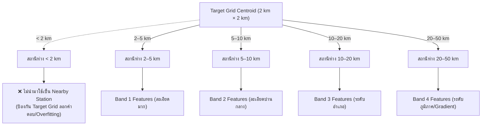

# 🗺️ Phase 3: 2 km Grid Generation & Spatial Feature Engineering

> **สถานะ**: ✅ ดำเนินการเสร็จสมบูรณ์ (Implemented & Verified)  
> **เป้าหมายหลัก**: สร้างโครงข่ายกริดสี่เหลี่ยมจัตุรัสขนาด 2 km × 2 km ครอบคลุมพื้นที่ประเทศไทย และออกแบบระบบคำนวณ Spatial Observation Features จากสถานีตรวจวัดภาคพื้นดินที่ผ่านการคัดกรองจาก Phase 1 โดยมีเกณฑ์การแบ่งวงระยะห่าง (Distance Bands) และการแปลงมุมทิศ (Bearing Sine/Cosine) เพื่อป้อนเข้าสู่โมเดล ML  
> **ข้อกำหนดพื้นที่ทำงาน**: โค้ดสร้างกริด (`src/features/`), ไฟล์ Shapefile/DEM (`data/geo/`), และตารางฟีเจอร์ (`data/features/`) ทั้งหมดถูกจัดเก็บและเรียกใช้งานภายใน `weather-forcast-enhance/` เท่านั้น ไม่มีการเรียกไฟล์ภายนอก

---

## 1. การสร้างและจัดการ Thailand 2 km × 2 km Master Grid

### 1.1 ขอบเขตเชิงพื้นที่และระบบพิกัด (Spatial Bounding Box & CRS)
- **พิกัดครอบคลุมประเทศไทย**:
  - ละติจูด (Latitude): $5.5^\circ\text{N}$ ถึง $20.5^\circ\text{N}$ (~1,670 km)
  - ลองจิจูด (Longitude): $97.3^\circ\text{E}$ ถึง $105.7^\circ\text{E}$ (~920 km)
- **ระบบพิกัดอ้างอิง (Coordinate Reference System - CRS)**:
  - Geographic CRS: `EPSG:4326` (WGS84 Lat/Lon)
  - Projected CRS: `EPSG:32647` (UTM Zone 47N) เพื่อให้ระยะทางกริด $2,000\text{ m} \times 2,000\text{ m}$ มีความแม่นยำทางมาตรวิทยา ไม่บิดเบี้ยวตามละติจูด
- **การตัด Mask ขอบเขตประเทศไทย**:
  - ใช้ Shapefile ขอบเขตประเทศไทย (Thailand National Boundary / GADM Level 0) ในการ Mask เลือกเฉพาะ Grid Cells ที่ตกอยู่บนแผ่นดินและชายฝั่ง

```text
+-------------------------------------------------------------+
|                     2 km × 2 km Master Grid                 |
|                                                             |
|   Cell ID: GRID_10294                                       |
|   Centroid: Lat = 13.7563, Lon = 100.5018                   |
|   UTM_X = 662,450 m, UTM_Y = 1,521,200 m                    |
|   Elevation = 4.2 m, Slope = 0.3 deg, Dist_Coast = 18.5 km  |
+-------------------------------------------------------------+
```

---

## 2. กฎการคัดเลือกสถานีตรวจวัดภาคพื้นดิน (Station Proximity Rules)

ตามข้อกำหนดใน [`weather-forcast-enhance/plan.md`](file:///e:/water-analysis-project/weather-forcast-enhance/plan.md) ข้อ 6:



> [!IMPORTANT]
> **ทำไมต้องตัดระยะ < 2 km ออกจากการเป็น Spatial Observation?**  
> เพราะหาก Target Grid มีสถานีวัดฝนตั้งอยู่ตรงนั้น แล้วโมเดลสามารถมองเห็นค่าฝนจากสถานีดังกล่าวโดยตรง โมเดลจะเรียนรู้แค่การ "ลอกค่าของสถานี" แทนที่จะเรียนรู้โครงสร้างทางอุตุนิยมวิทยาเชิงพื้นที่ และจะทำงานล้มเหลวทันทีใน Grid อื่นๆ ทั่วประเทศที่ไม่มีสถานีตั้งอยู่

---

## 3. การคำนวณ Spatial Features และการแปลงทางคณิตศาสตร์

สำหรับแต่ละ Target Grid Cell ณ เวลา `run_time`:

### 3.1 Polar Coordinates & Geometric Features
จาก Target Grid Centroid $(x_0, y_0)$ ไปยังสถานีตรวจวัด $(x_i, y_i)$:
- **ระยะห่าง (Euclidean Distance)**:
  $$d_i = \sqrt{(x_i - x_0)^2 + (y_i - y_0)^2}\quad (\text{km})$$
- **มุมทิศทาง (Bearing / Azimuth $\theta_i$)**:
  $$\theta_i = \text{atan2}(x_i - x_0, y_i - y_0)$$
- **การแปลง Cyclic Features (ป้องกันปัญหา Discontinuity ที่มุม $0^\circ / 360^\circ$)**:
  $$\text{bearing\_sin}_i = \sin(\theta_i)$$
  $$\text{bearing\_cos}_i = \cos(\theta_i)$$

### 3.2 ค่าสถิติเชิงพื้นที่แยกตาม Distance Bands (Spatial Aggregation)
1. **Band 2–5 km**:
   - `rain_mean_2_5km`, `rain_max_2_5km`
   - `pressure_mean_2_5km`, `pressure_std_2_5km`
   - `humidity_mean_2_5km`, `humidity_std_2_5km`
   - `nearest_station_dist_2_5km`
2. **Band 5–10 km**:
   - `rain_mean_5_10km`, `rain_max_5_10km`
   - `pressure_mean_5_10km`
   - `humidity_mean_5_10km`
3. **Band 10–20 km และ 20–50 km**:
   - `pressure_mean_20_50km`
   - `humidity_mean_20_50km`

### 3.3 เกรเดียนต์เชิงพื้นที่ (Spatial Atmospheric Gradients)
ชี้วัดความแตกต่างของความกดอากาศและความชื้น ซึ่งเป็นแรงขับเคลื่อนของลมและมวลอากาศ:
- **Pressure Gradient Vector ($\nabla P$)**:
  $$\frac{\partial P}{\partial x} \approx \frac{P_{\text{east}} - P_{\text{west}}}{\Delta x},\quad \frac{\partial P}{\partial y} \approx \frac{P_{\text{north}} - P_{\text{south}}}{\Delta y}$$
  $$\|\nabla P\| = \sqrt{\left(\frac{\partial P}{\partial x}\right)^2 + \left(\frac{\partial P}{\partial y}\right)^2}$$
- **Humidity Gradient Vector ($\nabla RH$)**:
  $$\|\nabla RH\| = \sqrt{\left(\frac{\partial RH}{\partial x}\right)^2 + \left(\frac{\partial RH}{\partial y}\right)^2}$$
- **Rainfall Density Gradient ($\nabla R$)**

---

## 4. ปัจจัยทางภูมิศาสตร์และภูมิประเทศ (Topographic & Geographic Features)

นำเข้าข้อมูลความสูงจาก Shuttle Radar Topography Mission (SRTM DEM 30m / 90m) สเกลลงสู่ 2 km Grid:
- `elevation_mean`: ความสูงเฉลี่ยเหนือระดับน้ำทะเล (เมตร)
- `elevation_std`: ความขรุขระของภูมิประเทศ (Topographic Roughness)
- `slope`: ความลาดชันของพื้นที่ (องศา)
- `aspect_sin`, `aspect_cos`: ทิศทางความลาดชัน (ชี้วัดด้านรับลมมรสุมหรือด้านอับลม / Windward vs Leeward)
- `distance_to_coast`: ระยะห่างจากแนวชายฝั่งทะเล (km)
- `latitude`, `longitude`: พิกัดทางภูมิศาสตร์

---

## 5. สถาปัตยกรรมการจัดเตรียมข้อมูลแบบตาราง (Unified Feature Matrix)

> 📖 **พจนานุกรมฟีเจอร์ฉบับสมบูรณ์**: ดูรายการฟีเจอร์โดยละเอียด สูตรคำนวณทางฟิสิกส์ หน่วยวัด และการจัดสรรตามรอบการทดลอง $M_1, M_2, M_3, M_4$ ได้ที่ [`feature_dictionary.md`](file:///e:/water-analysis-project/weather-forcast-enhance/ai-docs/plan/feature_dictionary.md)

เมื่อรวมฟีเจอร์ทุกมิติเข้าด้วยกัน แต่ละแถวในฐานข้อมูลฝึก (Training Row) จะมีโครงสร้างดังนี้:

```text
[KEYS & METADATA (เก็บเป็น Identifier เท่านั้น - ห้ามป้อนเข้า Tree Splitting เพื่อป้องกันจำพิกัด)]
  - grid_id
  - run_time
  - valid_time
  - lead_time (1h, 2h, ..., 24h)
  - target_lat, target_lon

[NWP FORECAST FEATURES]
  - nwp_rain_raw
  - nwp_temp_2m
  - nwp_pressure
  - nwp_rh_2m
  - nwp_u10, nwp_v10

[GROUND OBSERVATION SPATIAL FEATURES (t <= run_time)]
  - rain_mean_2_5km, rain_max_2_5km
  - pressure_mean_2_5km, pressure_std_2_5km, pressure_mean_5_10km
  - humidity_mean_2_5km, humidity_mean_5_10km
  - pressure_gradient_mag, humidity_gradient_mag
  - nearest_stn_dist_km, nearest_stn_bearing_sin, nearest_stn_bearing_cos

[HIMAWARI-9 SATELLITE FEATURES (t <= run_time)]
  - bt_b13_mean, bt_b13_min, bt_b13_std
  - bt_b13_lag10, bt_b13_lag20, bt_b13_lag30
  - bt_b13_delta30
  - bt_b08_wv_mean

[PHYSICAL TOPOGRAPHIC & GEOGRAPHIC FEATURES (ใช้แทนพิกัดดิบเพื่อความต่อเนื่องทางฟิสิกส์)]
  - elevation_m, elevation_std, slope_deg, aspect_sin, aspect_cos, dist_coast_km, coriolis_param

[TRAINING TARGET (Residual Bias)]
  - observed_rain (ณ target grid valid_time - เฉพาะ grid ที่มี rain gauge เพื่อการเทรน)
  - target_bias = observed_rain - nwp_rain_raw
```

---

## 6. สรุป Checklist ความพร้อม Phase 3

- [x] ออกแบบและสร้างโครงข่ายกริด 2 km × 2 km ในพิกัด `EPSG:32647` (UTM 47N) พร้อม Masking และพิกัดภูมิศาสตร์ WGS84 ([src/features/grid_generator.py](file:///e:/water-analysis-project/weather-forcast-enhance/src/features/grid_generator.py))
- [x] ติดตั้งโครงสร้างดัชนีเชิงพื้นที่ KDTree สำหรับค้นหาสถานีตาม Distance Bands (2–5, 5–10, 10–20, 20–50 km) ใน [src/features/spatial_features.py](file:///e:/water-analysis-project/weather-forcast-enhance/src/features/spatial_features.py)
- [x] ตรวจสอบกฎเหล็กตัดสถานีระยะ $< 2\text{ km}$ ออก เพื่อป้องกัน Target Grid ลอกคำตอบ (ผ่าน Unit Test 100%)
- [x] พัฒนาโมดูลคำนวณ $\nabla P, \nabla RH$ และการแปลงมุมทิศ Polar Coordinates $(\sin \theta, \cos \theta)$
- [x] สกัดคุณสมบัติทางภูมิประเทศ (DEM Elevation, Slope, Roughness, Aspect, Distance to Coast, Coriolis) บรรจุลงในตาราง Master Grid ([data/geo/thailand_2km_master_grid.parquet](file:///e:/water-analysis-project/weather-forcast-enhance/data/geo/thailand_2km_master_grid.parquet))
- [x] พัฒนาโมดูลประกอบ Unified Feature Matrix 49 คอลัมน์ รองรับการเทรน ML ([src/features/feature_builder.py](file:///e:/water-analysis-project/weather-forcast-enhance/src/features/feature_builder.py))
- [x] ผ่าน Unit Test Suite ทั้ง 4 ข้อสมบูรณ์แบบ ([src/features/test_spatial_features.py](file:///e:/water-analysis-project/weather-forcast-enhance/src/features/test_spatial_features.py))
- [x] พร้อมเข้าสู่ Phase 4 (Bias Correction Modeling & Training Pipeline) ทันทีที่ต้องการ
