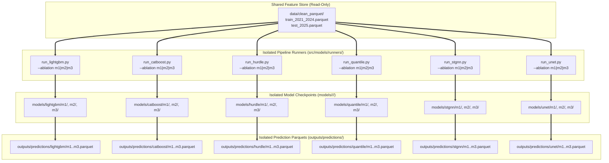

# 🤖 Phase 4: ML Bias Correction Modeling & Training Protocol

> **สถานะ**: ร่างแผนงาน (Planning Phase - Strict No Code)  
> **เป้าหมายหลัก**: พัฒนาระบบ Machine Learning เพื่อปรับแก้ความคลาดเคลื่อน (Bias Correction) ของผลพยากรณ์ฝนจาก Weather Model บน 2 km × 2 km Grid โดยใช้หลักการ Residual Learning พร้อมทั้งออกแบบการทดลอง Ablation Study ($B_0, M_1, M_2, M_3, M_4$) และระเบียบวิธีแบ่งข้อมูลตามแกนเวลา (Temporal Time-Split) 2021–2024 (Train/Val) และ 2025 (Final Frozen Test)  
> **ข้อกำหนดพื้นที่ทำงาน**: โค้ดฝึกและประเมินโมเดล (`src/models/`), คอนฟิกการทดลอง (`configs/`), และโมเดลที่บันทึก (`models/`) ต้องถูกจัดเก็บและเรียกใช้งานภายใน `weather-forcast-enhance/` ทั้งหมด ไม่มีการเรียกไฟล์ภายนอก

---

## 1. นิยามเป้าหมายการเรียนรู้ (Residual Bias Learning Target)

ตามข้อกำหนดใน [`weather-forcast-enhance/plan.md`](file:///e:/water-analysis-project/weather-forcast-enhance/plan.md) ข้อ 9:

โมเดล ML จะไม่ทำนายปริมาณฝนตั้งแต่ศูนย์ (Direct Precipitation Prediction) แต่จะทำหน้าที่เป็น **Bias Corrector สำหรับ Weather Model**:

$$\text{Residual Bias} = R_{\text{observed}} - R_{\text{model}}$$

```text
[Weather Model Forecast] ────> (+) ────────────────────────> [Corrected Forecast]
                                ▲                                  │
                                │                                  ▼
[Predicted Bias] ───────────────┘                          clip(result, min=0)
       ▲
       │
[LightGBM Model] <─── [NWP + Ground Features + Himawari-9 + Geo + Lead Time]
```

### การคำนวณผลพยากรณ์หลังปรับแก้ (Inference Equation):
$$R_{\text{corrected}} = \max\left(0.0,\; R_{\text{model}} + \widehat{\text{Bias}}\right)$$
*(ทำการตัดขอบล่างด้วย 0.0 เสมอ เนื่องจากปริมาณฝนทางกายภาพไม่สามารถติดลบได้)*

---

## 2. สถาปัตยกรรมโมเดลและ Loss Function (Model Architecture Suite)

เพื่อให้ระบบ Bias Correction มีประสิทธิภาพสูงสุดและครอบคลุมทุกมิติของข้อมูลฝน (Zero-inflation, Heavy tails, Spatial correlation, Uncertainty) โครงการจะทดสอบและเปรียบเทียบโมเดล 4 ตระกูลหลัก:

```text
┌─────────────────────────────────────────────────────────────────────────────────────────┐
│                        ชุดแบบจำลองเพื่อการทดสอบ (Model Benchmark Suite)                     │
├────────────────────────────────┬────────────────────────────────────────────────────────┤
│ 1. Advanced Tree-based         │ • LightGBM (Leaf-wise Baseline)                        │
│    (สกัดความสัมพันธ์แบบ Non-linear) │ • CatBoost (Symmetric Trees + Tweedie Loss)             │
│                                │ • XGBoost (Monotonic Physical Constraints)             │
├────────────────────────────────┼────────────────────────────────────────────────────────┤
│ 2. Two-Stage / Hurdle Models   │ • Hurdle GBDT (Stage 1: Classification P >= 0.1mm      │
│    (แก้ปัญหา Drizzle Bias & 0-rain)│                Stage 2: Conditional Residual Bias)     │
├────────────────────────────────┼────────────────────────────────────────────────────────┤
│ 3. Probabilistic & Quantile    │ • Multi-Quantile GBDT (Pinball Loss: q10, q50, q90, q95)│
│    (ประเมินความเสี่ยงและเตือนภัย)   │ • NGBoost (Natural Gradient - Zero-Inflated Gamma)      │
├────────────────────────────────┼────────────────────────────────────────────────────────┤
│ 4. Spatial Deep Learning       │ • Spatio-Temporal GNN (ST-GNN บน Graph สถานี + ทิศทางลม) │
│    (จับโครงสร้างเชิงพื้นที่ 2 km)   │ • 2D U-Net / ConvNeXt (Gridded Spatial Downscaling)     │
│                                │ • TabNet / FT-Transformer (Self-Attention บน Features)  │
└────────────────────────────────┴────────────────────────────────────────────────────────┘
```

### 2.1 รายละเอียดแต่ละตระกูลแบบจำลอง

#### ตระกูลที่ 1: Advanced Gradient Boosting Decision Trees (GBDTs)
1. **LightGBM Regressor (Fast Baseline)**:
   - จุดเด่น: เทรนรวดเร็วบนข้อมูลขนาดใหญ่ระดับสิบล้านแถว, จัดการ Histogram Binning ได้มีประสิทธิภาพ
2. **CatBoost Regressor (Noise-Resistant & Tweedie Objective)**:
   - จุดเด่น: ใช้ **Oblivious Trees (ต้นไม้สมมาตร)** ป้องกัน Overfitting จาก Noise ของเซนเซอร์สภาพอากาศ
   - รองรับ **Tweedie Deviance Loss** ซึ่งถูกออกแบบมาสำหรับข้อมูลที่มี Zero-inflated และ Positive Skewness สูงเช่นปริมาณฝน
3. **XGBoost with Monotonic Physical Constraints**:
   - จุดเด่น: กำหนด **Monotonicity Constraints** บังคับทิศทางตามกฎฟิสิกส์บรรยากาศ (เช่น อุณหภูมิยอดเมฆ $\Delta BT$ เย็นลงอย่างรวดเร็ว ต้องไม่ทำให้โอกาสเกิดฝนลดลง)

#### ตระกูลที่ 2: Two-Stage Hurdle Architecture (แก้ปัญหาฝนไม่ตก 90% และ Drizzle Bias) ⭐
เนื่องจากโมเดลเดี่ยวมักพยายามลด MSE รวมด้วยการทำนายฝนพรำ 0.1–0.3 mm กระจายไปทั่ว (Drizzle Artifacts):
- **Stage 1 (Rain Occurrence Classifier)**:
  - ทำนายความน่าจะเป็นที่ฝนตกจริง $P(\text{Rain} \ge 0.1\text{ mm})$ โดยใช้ Focal Loss หรือ Weighted LogLoss
- **Stage 2 (Conditional Bias Regressor)**:
  - เทรนเฉพาะข้อมูลชั่วโมงที่มีฝนตกจริง ($R \ge 0.1\text{ mm}$) เพื่อทำนายปริมาณความเบี่ยงเบน (Residual Bias)
- **การรวมผล (Inference)**:
  $$\widehat{R}_{\text{final}} = \begin{cases} 0.0 & \text{ถ้า } P(\text{Rain} \ge 0.1) < \tau_{\text{threshold}} \\ \max\left(0.0,\; R_{\text{model}} + \widehat{\text{Bias}}_{\text{cond}}\right) & \text{ถ้า } P(\text{Rain} \ge 0.1) \ge \tau_{\text{threshold}} \end{cases}$$

#### ตระกูลที่ 3: Probabilistic & Uncertainty Quantification (สำหรับการเตือนภัยอุทกวิทยา)
1. **Multi-Quantile GBDT (Pinball Loss)**:
   - ทำนายพร้อมกัน 4 ระดับ Percentile: $q_{10}$ (ฝนขั้นต่ำ), $q_{50}$ (ค่ามัธยฐาน), $q_{90}$ (กรณีฝนตกหนัก), $q_{95}$ (กรณีวิกฤต)
   - ช่วยให้ศูนย์เตือนภัยทราบ **Prediction Interval** ว่ามีโอกาสเกิดฝนตกหนักหลุดกรอบมากน้อยเพียงใด
2. **NGBoost (Natural Gradient Boosting)**:
   - พยากรณ์พารามิเตอร์ของ **Zero-Inflated Gamma Distribution** เพื่อคำนวณ $P(R \ge 10\text{ mm/h})$ หรือ $P(R \ge 20\text{ mm/h})$ เชิงตัวเลข

#### ตระกูลที่ 4: Spatial & Deep Learning (สกัดมิติเชิงพื้นที่ 2 km และทิศทางลม)
1. **Spatio-Temporal Graph Neural Network (ST-GNN / Graph WaveNet)**:
   - แปลงโครงข่ายสถานีตรวจวัดและจุดศูนย์กลางกริดเป็นกราฟ (Nodes) เชื่อมขอบ (Edges) ด้วยระยะทางและเวกเตอร์ทิศทางลม ($u_{10}, v_{10}$)
   - ถ่ายทอดข้อมูลเชิงพื้นที่ผ่าน Message Passing เพื่อจับการเคลื่อนที่ของกลุ่มฝน (Advection)
2. **2D U-Net / ConvNeXt (Gridded Super-Resolution & Bias Corrector)**:
   - ประมวลผลพื้นที่ประเทศไทยเป็น 2D Raster Tensor หลายแชนแนล (NWP Rainfall + Himawari IR BT + SRTM DEM) เพื่อปรับแก้ฝนเชิงพื้นที่แบบ Image-to-Image Regression
3. **FT-Transformer / TabNet**:
   - ใช้ Self-Attention สกัดน้ำหนักความสำคัญของฟีเจอร์สภาพอากาศแบบไดนามิกตามแต่ละฤดูกาล

---

### 2.2 ตารางเปรียบเทียบคุณสมบัติของโมเดลผู้สมัคร (Model Comparison Matrix)

| สถาปัตยกรรม | วัตถุประสงค์หลัก | การรับมือ Zero-Rain | ข้อมูลที่ต้องใช้ | ความต้องการ GPU | สถานะในโครงการ |
|---|---|:---:|---|:---:|:---:|
| **LightGBM** | Fast Tabular Baseline | ปานกลาง | ตารางฟีเจอร์ | ไม่จำเป็น | **Baseline** |
| **CatBoost (Tweedie)** | Robust Tree-based | ดี | ตารางฟีเจอร์ | ตัวเลือกเสริม | **Primary Benchmark** |
| **Hurdle GBDT** | **แก้ Drizzle Bias & ฝนตกหนัก** | **ยอดเยี่ยม** | ตารางฟีเจอร์ | ไม่จำเป็น | **Core Candidate** ⭐ |
| **Multi-Quantile GBDT** | **ประเมินความไม่แน่นอน ($q_{10}-q_{95}$)** | ดี | ตารางฟีเจอร์ | ไม่จำเป็น | **Risk Assessment** ⭐ |
| **ST-GNN** | จับทิศทางลมและการเคลื่อนตัวของฝน | ดีมาก | Graph Adjacency + ฟีเจอร์ | จำเป็น | **Research Exploration** |
| **2D U-Net / ConvNeXt** | Spatial Downscaling บน 2 km Raster | ดีมาก | Gridded Tensor 2D | จำเป็น | **Spatial Exploration** |

---

### 2.3 การออกแบบ Loss Function และ Objective พิเศษ
- **Tweedie Deviance**: $L(y, \mu) = -y \frac{\mu^{1-p}}{1-p} + \frac{\mu^{2-p}}{2-p}$ (โดย $1 < p < 2$ เพื่อคุม Compound Poisson-Gamma)
- **Huber Loss**: ป้องกันไม่ให้ฝนตกหนักรุนแรงดึง Weight ของโมเดลจนเสียทรง
- **Pinball Loss (Quantile Loss)**: สำหรับการเทรน $q_\alpha$ ในระดับเปอร์เซ็นไทล์ต่างๆ
- **Asymmetric Hydrological Penalty**: เพิ่มน้ำหนักการลงโทษกรณี **Underestimation** (พยากรณ์ว่าฝนไม่ตกแต่ตกหนักจริง) ให้สูงกว่า Overestimation

---

## 3. ตารางเมทริกซ์การทดลองแบบเต็มรูปแบบ (Full Experiment Matrix: Model Architecture × Ablation Variants)

ตามข้อกำหนดใน [`weather-forcast-enhance/plan.md`](file:///e:/water-analysis-project/weather-forcast-enhance/plan.md) ข้อ 10 และ 15 ร่วมกับข้อกำหนดการแยกทดลอง **แต่ละโมเดลต้องรันการทดลอง Ablation ทั้ง 3 รูปแบบ ($M_1, M_2, M_3$) แบบอิสระต่อกัน ($N_{\text{models}} \times 3$)**:

```text
                                  ┌─────────────────┐
                                  │   Weather Model │
                                  │     Raw (B0)    │
                                  └────────┬────────┘
                                           │
         ┌─────────────────────────────────┼─────────────────────────────────┐
         ▼                                 ▼                                 ▼
   [ M1 Variant ]                    [ M2 Variant ]                    [ M3 Variant ]
 Weather Model (NWP)               Weather Model (NWP)               Weather Model (NWP)
         +                                 +                                 +
Spatial Ground Observations         Himawari-9 Satellite             Spatial Ground Observations
(ฝน, ความกด, ความชื้น, ระยะห่าง)        (IR BT B13, B08, ΔBT)                         +
                                                                     Himawari-9 Satellite
```

### 3.1 รายการการทดลองทั้งหมด 18 Pipelines ($6 \text{ Models} \times 3 \text{ Variants}$) + $B_0$ Baseline

| โมเดล (Architecture) | รหัสการทดลอง (Run ID) | ชุดฟีเจอร์ที่ป้อนเข้าโมเดล | วัตถุประสงค์ในการตอบคำถามวิจัย |
|---|---|---|---|
| **0. Raw Baseline** | **`BASE-B0`** | ECMWF IFS / AIFS Raw Forecasts | Baseline สภาพอากาศโลกเดิม (ไม่ผ่านการปรับแก้) |
| **1. LightGBM** | **`LGBM-M1`** | NWP + Ground Observations (ฝน, ความกด, ความชื้น) | วัดประสิทธิภาพ Ground บน Leaf-wise GBDT |
| | **`LGBM-M2`** | NWP + Himawari-9 Satellite (IR B13, B08, $\Delta BT$) | วัดประสิทธิภาพ Satellite เดี่ยวๆ บน LightGBM |
| | **`LGBM-M3`** | NWP + Ground Observations + Himawari-9 | วัดพลังผสาน Ground + Satellite บน LightGBM |
| **2. CatBoost** | **`CAT-M1`** | NWP + Ground Observations (Tweedie Loss) | วัดความทนทานต่อ Sensor Noise ของสถานี |
| | **`CAT-M2`** | NWP + Himawari-9 Satellite | วัดความสามารถในการจับ Non-linear Cloud State |
| | **`CAT-M3`** | NWP + Ground Observations + Himawari-9 | โมเดลต้นไม้สมมาตรผสานข้อมูล 3 แหล่ง |
| **3. Hurdle GBDT** ⭐ | **`HURDLE-M1`** | NWP + Ground (Stage 1 Classify + Stage 2 Bias) | แก้ Drizzle Bias โดยใช้เฉพาะสถานีภาคพื้นดิน |
| *(Two-Stage)* | **`HURDLE-M2`** | NWP + Satellite (Stage 1 Classify + Stage 2 Bias) | ใช้ยอดเมฆคัดกรองฝนตก + คำนวณความเบี่ยงเบน |
| | **`HURDLE-M3`** | NWP + Ground + Satellite (Full Hurdle) | **Core Candidate: สองขั้นตอนผสานข้อมูลครบวงจร** |
| **4. Multi-Quantile** ⭐ | **`QUANT-M1`** | NWP + Ground $\rightarrow (q_{10}, q_{50}, q_{90}, q_{95})$ | หาช่วงความเชื่อมั่นฝนโดยอิงสถานีภาคพื้นดิน |
| *(Uncertainty)* | **`QUANT-M2`** | NWP + Satellite $\rightarrow (q_{10}, q_{50}, q_{90}, q_{95})$ | หาช่วงความเชื่อมั่นโดยอิงพัฒนาการของเมฆ |
| | **`QUANT-M3`** | NWP + Ground + Satellite $\rightarrow (q_{10}-q_{95})$ | **Risk Assessment: ช่วงความเสี่ยงฝนตกหนักครบทุกแหล่ง** |
| **5. ST-GNN** | **`STGNN-M1`** | NWP + Graph ของสถานีตรวจวัด HII + ลม | จำลองการเคลื่อนตัวของฝนระหว่างสถานีบนกราฟ |
| *(Graph Network)* | **`STGNN-M2`** | NWP + Node Satellite Features | ถ่ายทอดสถานะเมฆผ่านโครงข่ายเชิงพื้นที่ |
| | **`STGNN-M3`** | NWP + Graph สถานี + Node เมฆ + เวกเตอร์ลม | สกัด Advection เต็มรูปแบบบน Graph Topology |
| **6. 2D U-Net** | **`UNET-M1`** | NWP 2D Tensor + Interpolated Ground Tensor | Convolutional Downscaling อิงข้อมูลภาคพื้นดิน |
| *(Spatial CNN)* | **`UNET-M2`** | NWP 2D Tensor + Himawari 2D Raster Tensor | Downscaling อิงภาพถ่ายดาวเทียมความละเอียดสูง |
| | **`UNET-M3`** | NWP + Satellite + Ground 2D Raster Tensors | Super-Resolution 2 km ผสานภาพดาวเทียมและกริด |

---

## 4. สถาปัตยกรรมการแยก Pipeline การรันของแต่ละโมเดล (Decoupled & Isolated Model Pipelines)

> [!IMPORTANT]
> **หลักการแยก Pipeline อิสระ (Pipeline Decoupling & Fault Isolation):**  
> แต่ละโมเดลต้องมี Entrypoint Runner, Config, ไดเรกทอรี Checkpoint, และตารางผลลัพธ์แยกออกจากกันอย่างเด็ดขาด 100% การล้มเหลวของโมเดลหนึ่ง (เช่น ST-GNN เจอ CUDA Out-Of-Memory) จะต้องไม่ทำให้ Pipeline ของโมเดลอื่น (เช่น LightGBM หรือ CatBoost) หยุดชะงัก



### 4.1 โครงสร้างไฟล์และโฟลเดอร์สำหรับแยก Pipeline รัน

ทุกองค์ประกอบถูกแยกโฟลเดอร์ชัดเจนภายใต้ `weather-forcast-enhance/`:

```text
weather-forcast-enhance/
├── configs/models/
│   ├── lightgbm/       # lgbm_m1.yaml, lgbm_m2.yaml, lgbm_m3.yaml
│   ├── catboost/       # cat_m1.yaml, cat_m2.yaml, cat_m3.yaml
│   ├── hurdle/         # hurdle_m1.yaml, hurdle_m2.yaml, hurdle_m3.yaml
│   ├── quantile/       # quant_m1.yaml, quant_m2.yaml, quant_m3.yaml
│   ├── stgnn/          # stgnn_m1.yaml, stgnn_m2.yaml, stgnn_m3.yaml
│   └── unet/           # unet_m1.yaml, unet_m2.yaml, unet_m3.yaml
├── src/models/runners/
│   ├── run_lightgbm.py # สคริปต์รัน LightGBM (M1, M2, M3)
│   ├── run_catboost.py # สคริปต์รัน CatBoost (M1, M2, M3)
│   ├── run_hurdle.py   # สคริปต์รัน Hurdle Two-Stage (M1, M2, M3)
│   ├── run_quantile.py # สคริปต์รัน Multi-Quantile (M1, M2, M3)
│   ├── run_stgnn.py    # สคริปต์รัน Spatial Graph Neural Net (M1, M2, M3)
│   └── run_unet.py     # สคริปต์รัน 2D Convolutional U-Net (M1, M2, M3)
└── [output_dir]/       # ไดเรกทอรีปลายทางที่ผู้ใช้ระบุผ่านแฟล็ก --dir (Default: outputs/)
    ├── models/         # เช็คพอยต์และไฟล์โมเดลแต่ละแบบ
    │   ├── lightgbm/   # m1/model.txt, m2/model.txt, m3/model.txt
    │   ├── catboost/   # m1/model.cbm, m2/model.cbm, m3/model.cbm
    │   ├── hurdle/     # m1/{clf,reg}.txt, m2/{clf,reg}.txt, m3/{clf,reg}.txt
    │   ├── quantile/   # m1/q*.txt, m2/q*.txt, m3/q*.txt
    │   ├── stgnn/      # m1/checkpoint.pt, m2/checkpoint.pt, m3/checkpoint.pt
    │   └── unet/       # m1/checkpoint.pt, m2/checkpoint.pt, m3/checkpoint.pt
    └── predictions/    # ผลการพยากรณ์ CSV & Parquet สำหรับใช้ Benchmark อื่นๆ
        ├── lightgbm/   # lgbm_m1_pred.csv, lgbm_m2_pred.csv, lgbm_m3_pred.csv
        ├── catboost/   # cat_m1_pred.csv, ...
        ├── hurdle/     # hurdle_m1_pred.csv, ...
        ├── quantile/   # quant_m1_pred.csv (พร้อม q10, q50, q90, q95), ...
        ├── stgnn/      # stgnn_m1_pred.csv, ...
        └── unet/       # unet_m1_pred.csv, ...
```

### 4.2 มาตรฐาน Command Line Interface (CLI) และตัวเลือก `--dir`

ทุก Runner สคริปต์ใน `src/models/runners/` ต้องรองรับ argument `--dir` เพื่อให้ผู้ใช้สามารถกำหนดไดเรกทอรีปลายทางสำหรับจัดเก็บผลลัพธ์ได้อย่างอิสระ:

```bash
# ตัวอย่างการสั่งรันพร้อมระบุ --dir ปลายทาง
python src/models/runners/run_lightgbm.py --ablation m3 --config configs/models/lightgbm/lgbm_m3.yaml --dir outputs/benchmark_2025/
python src/models/runners/run_hurdle.py   --ablation m3 --config configs/models/hurdle/hurdle_m3.yaml   --dir outputs/hurdle_experiment/
python src/models/runners/run_catboost.py --ablation all --dir outputs/catboost_full_runs/

# หากไม่ระบุ --dir ระบบจะกำหนดค่าเริ่มต้น (Default) เป็น: outputs/
python src/models/runners/run_lightgbm.py --ablation m1
```

#### รายละเอียดโครงสร้าง CSV Result การพยากรณ์ (`--dir/predictions/<model>/<model>_<ablation>_pred.csv`):
เพื่อให้ชุดข้อมูลพยากรณ์สามารถส่งต่อไปยัง Benchmark อื่นๆ ได้อย่างสมบูรณ์ ไฟล์ CSV ผลลัพธ์จะประกอบด้วยคอลัมน์มาตรฐาน:

| ชื่อคอลัมน์ (CSV Column) | ชนิดข้อมูล | คำอธิบาย |
|---|:---:|---|
| `valid_time` | ISO8601 | วันและเวลาเป้าหมายที่ผลพยากรณ์มีผล (UTC หรือ GMT+7) |
| `run_time` | ISO8601 | รอบเวลาที่แบบจำลอง NWP เริ่มต้นรัน (00Z หรือ 12Z) |
| `lead_time` | integer | ระยะเวลานำหน้า (ชั่วโมง: 1 ถึง 24+) |
| `station_id` | string | รหัสสถานีตรวจวัดน้ำฝน (HII หรือ DWR) |
| `lat`, `lon` | float32 | พิกัดละติจูดและลองจิจูดของจุดพยากรณ์ |
| `basin_id` | string | ลุ่มน้ำที่จุดพยากรณ์สังกัด (เช่น Yom, Nan, Mun, Chi, etc.) |
| `observed_rain` | float32 | ปริมาณน้ำฝนจริงที่วัดได้ ณ เวลาจริง (mm/h) |
| `nwp_raw_rain` | float32 | ปริมาณน้ำฝนดิบจาก Weather Model ก่อนปรับแก้ (mm/h) |
| `predicted_bias` | float32 | ค่า Bias ที่โมเดลทำนายได้ (mm/h) |
| `corrected_rain` | float32 | ปริมาณน้ำฝนหลังปรับแก้: $\max(0, \text{nwp\_raw} + \text{bias})$ |
| `model_name` | string | ชื่ออัลกอริทึม (เช่น `lightgbm`, `hurdle_gbdt`, `catboost`) |
| `ablation` | string | รูปแบบตัวแปรทดลอง (`m1`, `m2`, `m3`) |
| `q10`, `q50`, `q90`, `q95` | float32 | *(เฉพาะโมเดล Quantile)* ค่าพยากรณ์ ณ ระดับควอนไทล์ต่างๆ |

---

## 5. ระเบียบวิธีแบ่งข้อมูลตามแกนเวลา (Temporal Time-Split Protocol)

ตามข้อกำหนดใน [`weather-forcast-enhance/plan.md`](file:///e:/water-analysis-project/weather-forcast-enhance/plan.md) ข้อ 11–12:

```text
[ 2021 ] ──────── [ 2022 ] ──────── [ 2023 ] ──────── [ 2024 ] ║  [ 2025 ]
─────────────────────────────────────────────────────────────║─────────────
                    TRAIN & VALIDATION                       ║  FINAL TEST
                                                             ║  (FROZEN)
Fold 1: Train (2021-2022) ──────> Val (2023)                 ║  (ห้ามแตะต้อง)
Fold 2: Train (2021-2023) ──────> Val (2024)                 ║
Final Retrain: All 2021–2024 ────────────────────────────────║──> Test 2025
```

> [!CAUTION]
> **กฎเหล็กเรื่องปี 2025 (Strictly Frozen Test Set):**  
> 1. ห้ามใช้ข้อมูลปี 2025 ในการคัดเลือกตัวแปร (Feature Selection)  
> 2. ห้ามใช้ข้อมูลปี 2025 ในการปรับจูน Hyperparameter Tuning  
> 3. ข้อมูลปี 2025 จะถูกนำมาใช้เพียงครั้งเดียวเพื่อรันโมเดลที่ฝึกเสร็จสิ้นแล้วจากปี 2021–2024 และบันทึกผลลงใน `outputs/predictions/<model>/<ablation>_2025.parquet`

> [!IMPORTANT]
> **กฎเหล็กการกันข้อมูลสถานี DWR (`weather-forcast-enhance/dataset/dwr_rain/`):**  
> ข้อมูลตรวจวัดน้ำฝนของกรมทรัพยากรน้ำ (DWR) ทั้งหมดใน `dataset/dwr_rain/` **ห้ามนำเข้ามาใช้ในกระบวนการฝึกสอน (Train), ปรับจูน (Validation), หรือสร้างฟีเจอร์สังเกตการณ์ภาคพื้นดิน (Spatial Features) ในขั้นตอนใดๆ โดยเด็ดขาด 100%!**  
> ข้อมูล DWR ถูกสงวนไว้เป็น **100% Blind Out-of-Network Spatial Hold-Out** สำหรับประเมินความแม่นยำบนสถานีที่ไม่รู้จักใน Phase 5 เท่านั้น

---

## 6. การปรับแต่ง Hyperparameters และการควบคุม Overfitting

- **Hyperparameter Search**: Bayesian Optimization (Optuna) บน Fold 1 และ Fold 2
- **Parameters ควบคุมตามประเภทโมเดล**:
  - **Tree Models (LightGBM/CatBoost/Hurdle)**: `max_depth`, `learning_rate`, `subsample`, `colsample_bytree`, `min_child_samples`
  - **Quantile Model**: Pinball loss parameters ($\alpha \in \{0.1, 0.5, 0.9, 0.95\}$)
  - **Deep Models (ST-GNN/UNet)**: Weight decay, Dropout rate (0.2–0.3), Cosine Annealing Learning Rate Scheduler
- **Early Stopping**: หยุดเทรนหากค่า Validation Loss ไม่ดีขึ้นติดต่อกัน 50 rounds (หรือ 15 epochs สำหรับ Deep Learning)

---

## 7. สรุป Checklist ความพร้อม Phase 4

- [ ] กำหนดสมการ Residual Bias และสมการ Inference พร้อม Non-negative Clipping
- [ ] ออกแบบเมทริกซ์การทดลองเต็มรูปแบบ 18 รูปแบบ ($6 \text{ Models} \times 3 \text{ Variants}: M_1, M_2, M_3$)
- [ ] ติดตั้งโครงสร้าง Runner แยกเดี่ยว 6 สคริปต์ใน `src/models/runners/` พร้อมระบบ Fault Isolation
- [ ] จัดเตรียม Configs แยกโมเดลและแยกรอบการทดลองใน `configs/models/<model>/<variant>.yaml`
- [ ] จัดเตรียมไดเรกทอรีจัดเก็บ Checkpoints และ Prediction Parquets แยกตามโมเดลและ Variant ใน `models/` และ `outputs/predictions/`
- [ ] วางระบบ Cross-Validation แบบ Temporal Expanding-Window (2021–2024)
- [ ] ล็อกสิทธิ์การเข้าถึงข้อมูลปี 2025 ไม่ให้รั่วไหลเข้าสู่กระบวนการ Training ของทุกโมเดล
- [ ] บล็อกไม่ให้ข้อมูลสถานี DWR ใน `dataset/dwr_rain/` รั่วไหลเข้าสู่ชุดฝึกหรือการคำนวณ Spatial Features อย่างเด็ดขาด (สงวนไว้เป็น Blind Test Set ใน Phase 5)

